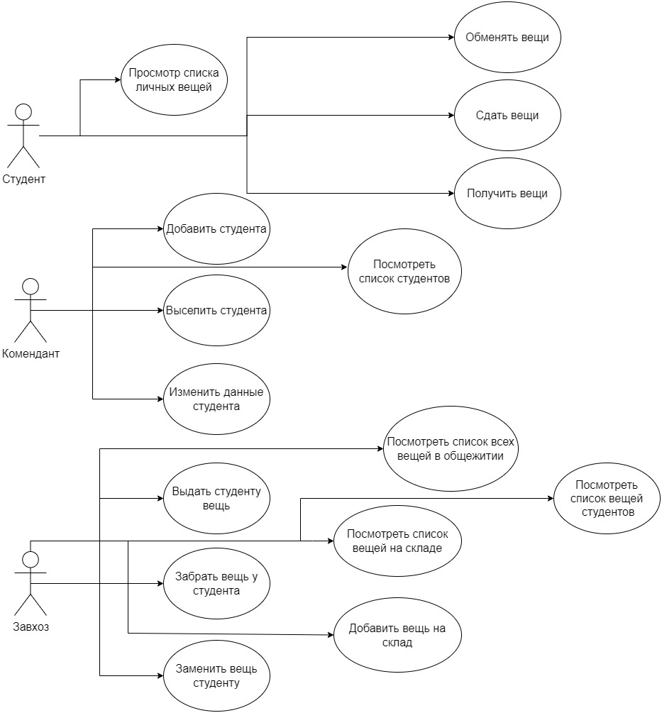
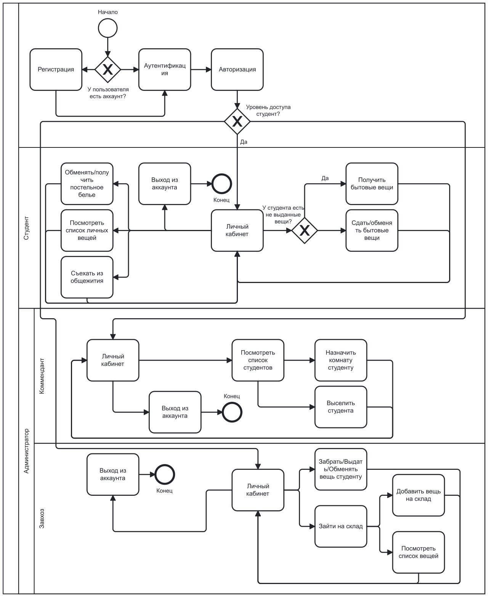
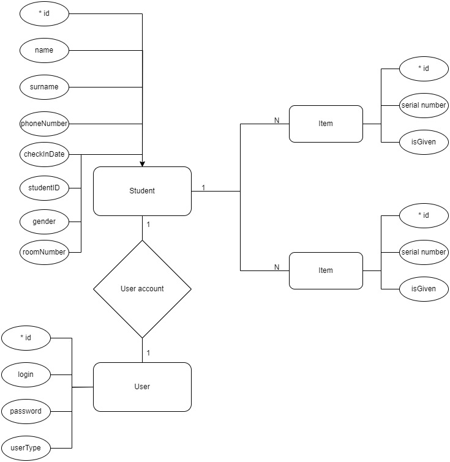
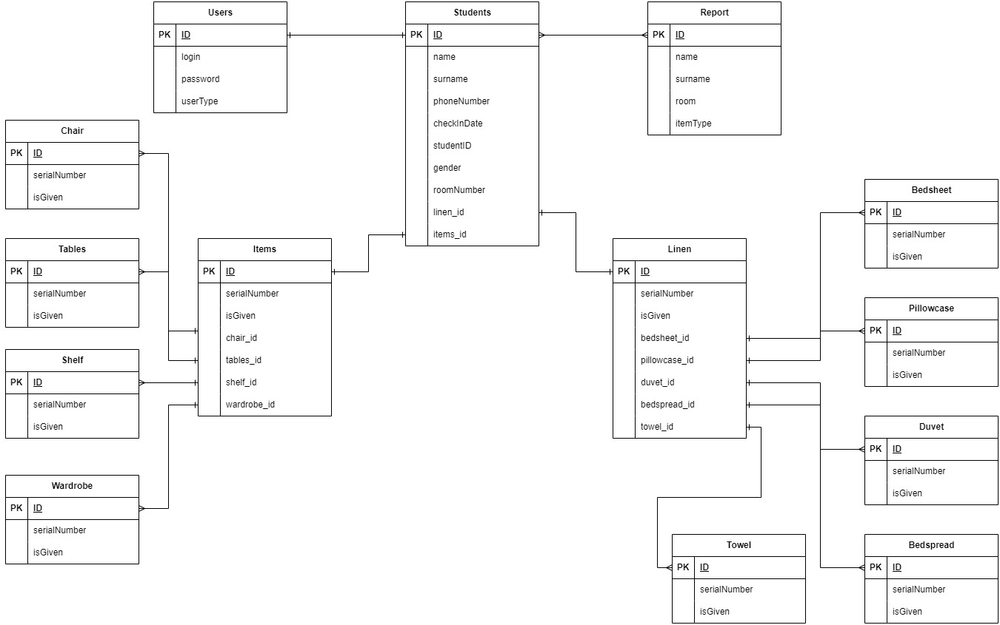
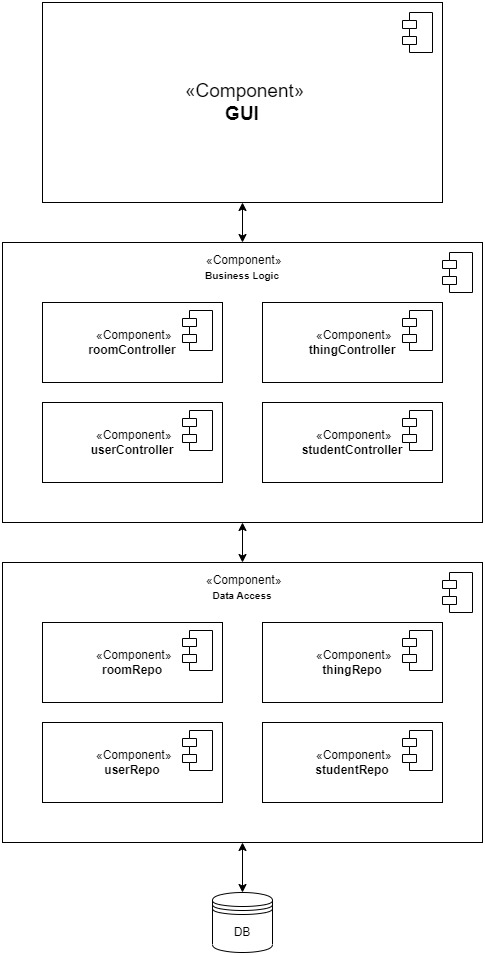
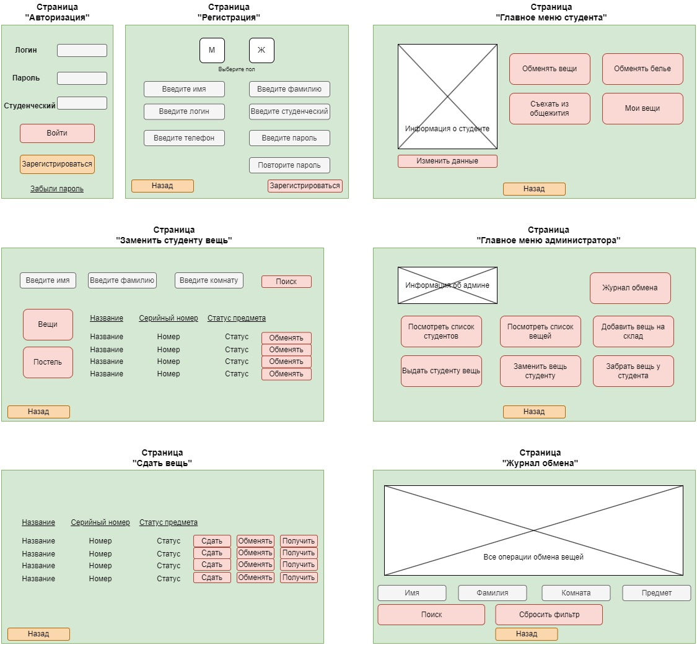

# BMSTU-WEB

# Проект "Система выдачи бытовых вещей студентам в общежитии"

## Цель работы

Цель данного проекта - разработать веб-приложение, которое позволит студентам удобно сдавать и получать бытовые вещи в общежитии, улучшая учет и организацию процесса.

## Решаемая проблема/предоставляемая возможность

Проблема: В общежитии используется бумажный вариант ведения учета за бытовыми вещами, в следствии чего, часто бывают несостыковки записей, указанных на бумаге с реальными.

Решение: Разработать веб-приложение для автоматического учета сдачи/выдачи вещей.

## Краткий перечень функциональных требований

1. Регистрация и авторизация пользователей.
2. Нажатие кнопки "Получить вещь" для автоматической выдачи вещи.
3. Отображение списка доступных вещей для студентов.
4. Отслеживание истории полученных вещей.
5. Уведомления о получении новой вещи.

## Use-case диаграмма системы



## BPMN диаграмма основных бизнес-процессов



## Примеры описания основных пользовательских сценариев

### Получение вещей

1. Пользователь регистрируется и авторизуется в системе.
2. Открывается меню с возможностью обмена вещей и белья, а также просмотр списка вещей.
3. После нажатия на кнопку "Получить", система случайным образом выбирает вещь из доступных и выдает ее пользователю.
4. Предмет автоматически добавляется в историю полученных предметов.

### Обмен вещей

1. Пользователь регистрируется и авторизуется в системе.
2. Открывается меню выбирает "Добавить вещь на склад".
3. После нажатия на кнопку "Обменять", система забирает предмет у студента и случайным образом выбирает новую вещь из доступных и выдает ее.
4. Предмет автоматически добавляется в историю полученных предметов.

### Добавление вещей на склад

1. Администратор авторизуется в системе.
2. Открывается меню с возможностью обмена вещей и белья, а также просмотр списка вещей.
3. После нажатия на кнопку "Добавить", система добавляет предмет на склад.
4. Предмет становится доступным для получения.

### Выселение студента администратором

1. Администратор авторизуется в системе.
2. Открывается меню с возможностью выселить студента.
3. После нажатия на кнопку "Выселить", система изменяет статус студента и отправляет все его вещи на склад.

### Просмотр журнала обмена

1. Администратор авторизуется в системе.
2. Открывается меню с возможностью просмотра журнала обмена.
3. После нажатия на кнопку, система выводит полный список обмена вещей за определнный период.
4. Есть возможность использовать фильтры для просмотра определнных студентов.

## ER-диаграмма сущностей



## Диаграмма БД



## Компонентная диаграмма системы



## Экраны будущего web-приложения



# Запуск и остановка Nginx

```bash
.\nginx.exe

.\nginx.exe -s stop
```

# Запуск тестов

```bash
npm test
```

# Запуск линтера

```bash
npx eslint .
```

# Нагрузочное Тестирование и Балансировка нагрузки

Для проведения нагрузочного тестирования была использована утилита ApacheBenchmark. Был выполнен тест на запрос /api/v1/myitems/2 с параметрами:

- Количество запросов: 10
- Количество параллельных соединений: 2

```bash
ab -n 10 -c 2 http://localhost:8080/api/v1/myitems/2
```

## Результаты

### Логи сервера

В логах сервера были зафиксированы успешные запросы (HTTP 200) и запросы, завершившиеся с ошибкой (HTTP 500). Это указывает на то, что балансировка нагрузки работает, так как запросы распределяются между различными серверами.

### Статистика ApacheBenchmark

Статистика ApacheBenchmark показала следующие результаты:

```bash
Запросы в секунду: 3.18
Среднее время на запрос: 629.719 мс
Процент запросов, выполненных в пределах определенного времени:
50%: 248 мс
66%: 261 мс
75%: 332 мс
80%: 370 мс
90%: 397 мс
95%: 397 мс
98%: 397 мс
99%: 397 мс
100%: 397 мс (самый долгий запрос)
```

Вывод Лог файла

```bash
127.0.0.1 - - [16/Feb/2024:21:37:57 +0300] "GET /api/v1/myitems/2 HTTP/1.0" 200 235 "-" "ApacheBench/2.3" "-" "[::1]:5001"
127.0.0.1 - - [16/Feb/2024:21:37:57 +0300] "GET /api/v1/myitems/2 HTTP/1.0" 200 235 "-" "ApacheBench/2.3" "-" "127.0.0.1:5001"
127.0.0.1 - - [16/Feb/2024:21:37:57 +0300] "GET /api/v1/myitems/2 HTTP/1.0" 500 82 "-" "ApacheBench/2.3" "-" "[::1]:5191"
127.0.0.1 - - [16/Feb/2024:21:37:57 +0300] "GET /api/v1/myitems/2 HTTP/1.0" 500 82 "-" "ApacheBench/2.3" "-" "[::1]:5191"
127.0.0.1 - - [16/Feb/2024:21:37:57 +0300] "GET /api/v1/myitems/2 HTTP/1.0" 500 82 "-" "ApacheBench/2.3" "-" "127.0.0.1:5191"
127.0.0.1 - - [16/Feb/2024:21:37:57 +0300] "GET /api/v1/myitems/2 HTTP/1.0" 200 235 "-" "ApacheBench/2.3" "-" "127.0.0.1:5191"
127.0.0.1 - - [16/Feb/2024:21:37:57 +0300] "GET /api/v1/myitems/2 HTTP/1.0" 500 82 "-" "ApacheBench/2.3" "-" "127.0.0.1:5000"
127.0.0.1 - - [16/Feb/2024:21:37:57 +0300] "GET /api/v1/myitems/2 HTTP/1.0" 200 235 "-" "ApacheBench/2.3" "-" "[::1]:5001"
127.0.0.1 - - [16/Feb/2024:21:37:57 +0300] "GET /api/v1/myitems/2 HTTP/1.0" 200 235 "-" "ApacheBench/2.3" "-" "127.0.0.1:5001"
127.0.0.1 - - [16/Feb/2024:21:37:57 +0300] "GET /api/v1/myitems/2 HTTP/1.0" 200 235 "-" "ApacheBench/2.3" "-" "[::1]:5000"
```
